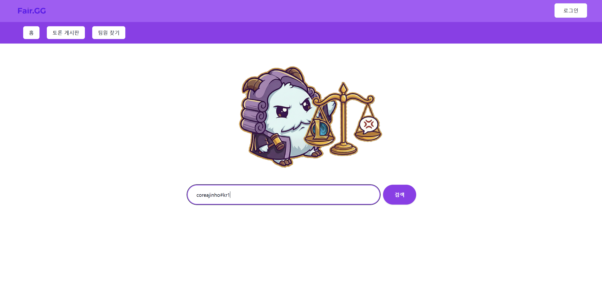
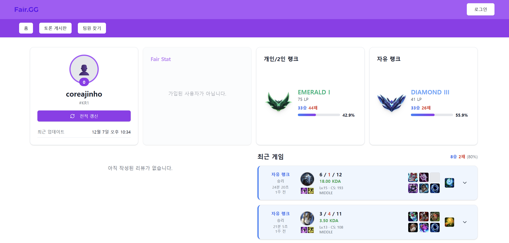
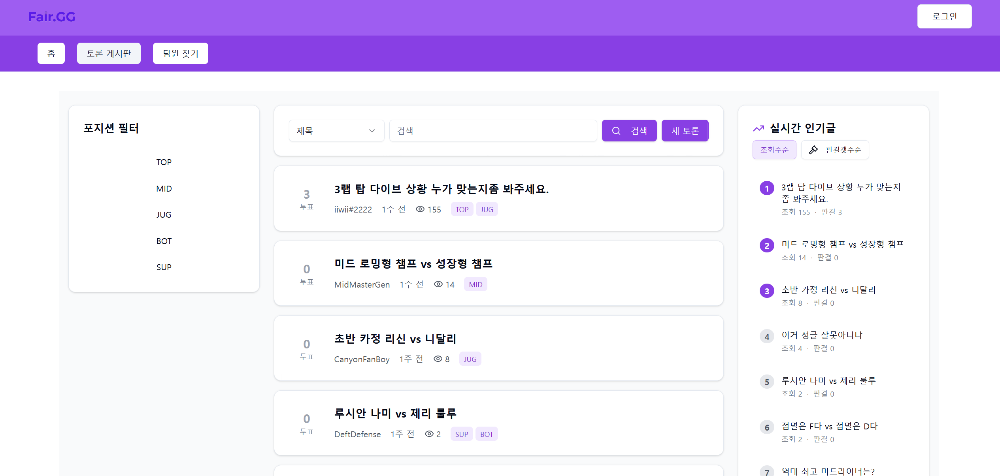
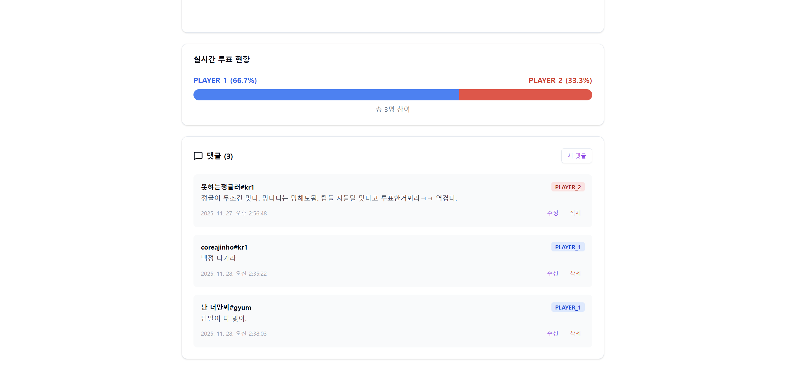

# 🎮 Fair.GG - League of Legends 전적 검색 및 토론 커뮤니티 플랫폼

## 1. 프로젝트 소개 (Introduction)
**Fair.GG**는 라이엇 게임즈(Riot Games)의 데이터를 기반으로 소환사의 전적을 분석하고, 게임 내에서 발생한 다양한 상황에 대해 커뮤니티 유저들과 심도 있는 토론을 나눌 수 있는 웹 애플리케이션입니다.


## 2. 주요 기능 (Key Features)

### 🔍 소환사 전적 검색 및 분석 (Summoner Search & Analysis)
Riot API를 활용하여 소환사의 실시간 정보를 제공합니다.
- **실시간 계정 정보 조회**: Riot ID(`GameName`#`TagLine`)를 기반으로 소환사를 검색합니다.
- **랭크 정보 시각화**: 솔로 랭크 및 자유 랭크의 티어, LP, 승률($\text{WinRate} = \frac{\text{Wins}}{\text{Wins} + \text{Losses}} \times 100$) 데이터를 시각적으로 제공합니다.
- **매치 히스토리 병렬 처리**: 최근 10게임의 상세 데이터를 로딩합니다.
- **상세 전적 데이터**: KDA, 챔피언 정보, 아이템 빌드, 룬 정보 등을 타임라인에 맞춰 제공합니다.

### ⚖️ 과실 비율 토론 시스템 (Debate System)
게임 중 발생한 논쟁적인 상황(예: "누가 더 잘못했나?")을 영상과 함께 게시하여 유저들의 투표를 받는 핵심 기능입니다.
- **영상 기반 게시물 작성**: YouTube URL 임베딩을 지원하여 상황을 객관적으로 보여줄 수 있습니다.
- **진영 투표 로직**: 댓글 작성 시 `PLAYER_1` 혹은 `PLAYER_2` 진영을 선택하게 되며, 이는 실시간 투표율로 계산되어 프로그레스 바(Progress Bar) 형태로 시각화됩니다.
- **포지션 필터링**: 탑, 정글, 미드 등 포지션 태그 기반의 필터링을 통해 관심 있는 라인의 토론만 모아볼 수 있습니다.
- **인기 게시글 알고리즘**: 조회수와 댓글(판결) 수를 기준으로 트렌딩 게시물을 선별하여 메인에 노출합니다.

## 📸 스크린샷 (Screenshots)

| 메인 페이지 (검색) | 소환사 전적 조회 |
| :---: | :---: |
|  |  |
| **토론 게시판 목록** | **토론 상세 (투표 및 댓글)** |
|  |  |

## 3. 기술 스택 (Tech Stack)

### Backend
- **Language**: Java 17
- **Framework**: Spring Boot 3.x
- **Database Access**: Spring Data JPA
- **Security**: Spring Security, JWT
- **Database**: MySQL 8.0

### Frontend
- **Framework**: React 18
- **Build Tool**: Vite
- **Styling**: Tailwind CSS, **shadcn/ui** (Radix UI base) - *Modern & Accessible Components*
- **State Management**: React Context API (AuthProvider)
- **HTTP Client**: Axios
- **Routing**: React Router DOM v6

### Infrastructure & Tools
- **Containerization**: Docker, Docker Compose (for Database)
- **IDE**: IntelliJ IDEA (Backend), VS Code (Frontend)

---

## 4. 실행 방법 (Getting Started)
본 프로젝트는(서버에 배포 전 이므로) 로컬 개발 환경에서 실행하기 위해 다음과 같은 절차가 필요합니다. 사전에 **Java 17+, Node.js 18+, Docker**가 설치되어 있어야 합니다.

### Step 1: 데이터베이스 환경 구축 (Docker)
백앤드 폴더의 루트 경로에 있는 `docker-compose.yml`(또는 별도 DB 설정)을 확인 후, 터미널에서 아래 명령어를 실행하여 MySQL 컨테이너를 실행합니다.

```bash
docker-compose up -d 
(참고: DB가 실행되면 Flyway가 자동으로 스키마를 생성합니다.)
``` 

### Step 2: 백엔드 서버 실행 (IntelliJ IDEA)
백앤드 폴더의 .env 파일에 적힌 내용을 확인한 후 환경변수로 등록합니다.(개발 환경의 프론트앤드 서버 주소를 확인하여 등록합니다.)

이후 ide의 실행(Run) 버튼을 클릭합니다.

### Step 3: 프론트엔드 서버 실행 (VS Code)
프론트앤드 폴더의 .env 파일에 적힌 백앤드 서버 주소를 실행 환경에 맞게 설정합니다.
그 후 아래의 명령어를 실행합니다.
```bash
npm install(라이브러리 설치)
npm run dev(개발서버 작동)
```
### Step 4: 웹 애플리케이션 접속
브라우저를 열고 http://localhost:5173 (Vite 기본 포트)으로 접속하여 프로젝트가 정상적으로 동작하는지 확인합니다.(환경에 맞게 변경 해야합니다.)


## 5. 참고 자료 (References)
본 프로젝트는 Riot Games의 지적 재산권 가이드를 준수하며 개발되었습니다.

Riot API Documentation: https://developer.riotgames.com/apis - 소환사 정보, 매치 데이터, 랭크 정보 조회에 사용되었습니다.

Data Dragon: https://developer.riotgames.com/docs/lol#data-dragon - 챔피언 이미지, 아이템 아이콘, 스펠 이미지 등의 정적 자산(Assets) 처리에 사용되었습니다.